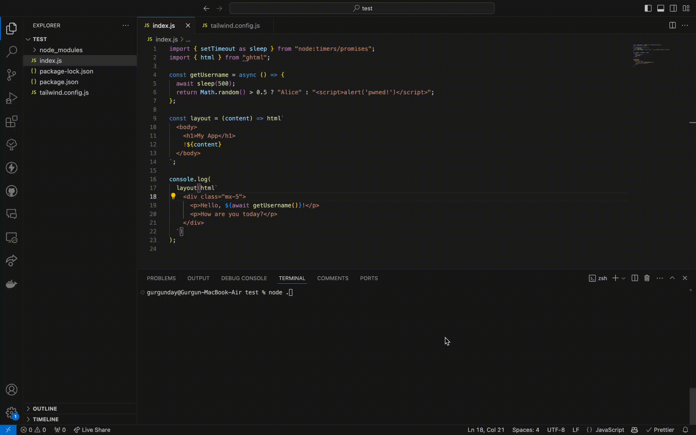

# ghtml 

ta**ghtml** lets you replace your template engine with fast JavaScript by leveraging the power of tagged templates.

Works in the browser. No runtime dependencies. [~30x faster than React. ~10x faster than common-tags.](#benchmarks)



## Installation

```sh
npm i ghtml
```

Or import directly from a CDN:

```js
import { html } from "https://cdn.jsdelivr.net/npm/ghtml/+esm";
```

## API

### `html`

The `html` function is designed to tag template literals and automatically escape their expressions. To intentionally bypass escaping a specific expression, prefix it with `!`.

### `htmlGenerator`

The `htmlGenerator` function acts as the generator version of the `html` function. It facilitates the creation of HTML fragments iteratively, making it ideal for parsing large templates or constructing HTML content dynamically.

**Note:**

Keep in mind that, in Node.js, all else being equal, streaming a response using synchronous generators is **always** slower than processing everything directly and sending it at once — [this also applies to TTFB](https://github.com/mcollina/fastify-html/issues/11#issuecomment-2069385895). However, if a template includes promises that do asynchronous operations (I/O, etc.), then `htmlAsyncGenerator` can be used to stream the response as those promises get resolved, which does indeed improve TTFB.

### `htmlAsyncGenerator`

This version of HTML generator should be preferred for asynchronous and streaming use cases. The output is generated as the promise expressions resolve or stream expressions send data.

**Note:**

Because they return generators instead of strings, a key difference of `htmlGenerator` and `htmlAsyncGenerator` is their ability to recognize and properly handle iterable elements within array expressions. This is to detect nested `htmlGenerator` and `htmlAsyncGenerator` usage, enabling scenarios such as ``${[1, 2, 3].map(i => htmlGenerator`<li>${i}</li>`)}``.

### `includeFile`

Available in Node.js, the `includeFile` function is a wrapper around `readFileSync`. It reads and returns the content of a file while caching it in memory for faster future reuse.

## Usage

### `html`

```js
import { html } from "ghtml";

const username = '';
const greeting = html`<h1>Hello, ${username}</h1>`;

console.log(greeting);
// Output: <h1>Hello, &#60;img src&#61;&#34;https://example.com/pwned.png&#34;&#62;</h1>
```

To bypass escaping:

```js
const img = '';
const container = html`<div>!${img}</div>`;

console.log(container);
// Output: <div></div>
```

When nesting multiple `html` expressions, make sure to use `!` as the inner calls do their own escaping:

```js
const someCondition = Math.random() >= 0.5;
const data = {
  username: "John",
  age: 21,
};

const htmlString = html`
  <div>
    !${someCondition
      ? html`
          <p>Data:</p>
          <ul>
            !${Object.values(data).map(
              ([key, val]) => html`<li>${key}: ${val}</li>`,
            )}
          </ul>
        `
      : html`<p>No data...</p>`}
  </div>
`;
```

```js
import { html } from "ghtml";
import http from "node:http";

http
  .createServer((req, res) => {
    const htmlContent = html`<!doctype html>
      <html>
        <p>You are at: ${req.url}</p>
      </html>`;
    res.writeHead(200, { "Content-Type": "text/html;charset=utf-8" });
    res.write(htmlContent);
    res.end();
  })
  .listen(3000);
```

### `htmlGenerator`

```js
import { htmlGenerator as html } from "ghtml";
import { Readable } from "node:stream";
import http from "node:http";

const generator = function* () {
  yield "Hello, World!";
};

http
  .createServer((req, res) => {
    const htmlContent = html`<!doctype html>
      <html>
        <p>${generator()}</p>
      </html>`;
    const readableStream = Readable.from(htmlContent);
    res.writeHead(200, { "Content-Type": "text/html;charset=utf-8" });
    readableStream.pipe(res);
  })
  .listen(3000);
```

### `htmlAsyncGenerator`

```js
import { htmlAsyncGenerator as html } from "ghtml";
import { createReadStream } from "node:fs";
import { readFile } from "node:fs/promises";
import { Readable } from "node:stream";
import http from "node:http";

const asyncGenerator = async function* () {
  const helloWorld = new Promise((resolve) => {
    setTimeout(() => {
      resolve("<br /><br />Hello, World!");
    }, 2500);
  });
  yield await readFile("./.gitignore", "utf8");
  yield helloWorld;
};

http
  .createServer((req, res) => {
    const htmlContent = html`<!doctype html>
      <html>
        <p>!${asyncGenerator()}</p>
        <code>${readFile("./README.md", "utf8")}</code>
        <code>${createReadStream("./README.md", "utf8")}</code>
      </html>`;
    const readableStream = Readable.from(htmlContent);
    res.writeHead(200, { "Content-Type": "text/html;charset=utf-8" });
    readableStream.pipe(res);
  })
  .listen(3000);
```

### `includeFile`

```js
import { includeFile } from "ghtml/includeFile.js";

const logo = includeFile("static/logo.svg");

console.log(logo);
// Output: content of "static/logo.svg"
```

## Benchmarks

Latest results [from Kita](https://github.com/kitajs/html/tree/cb7950c68489ff70dd0b0c130c9b70046c1543ea/benchmarks):

```sh
benchmark        time (avg)             (min … max)       p75       p99      p999
--------------------------------------------------- -----------------------------
• Real World Scenario
--------------------------------------------------- -----------------------------
KitaJS/Html     505 µs/iter     (387 µs … 2'007 µs)    417 µs  1'209 µs  1'857 µs
Typed Html    1'844 µs/iter   (1'604 µs … 2'415 µs)  2'088 µs  2'211 µs  2'415 µs
VHtml         2'424 µs/iter   (2'250 µs … 2'864 µs)  2'462 µs  2'829 µs  2'864 µs
React JSX     6'416 µs/iter   (5'893 µs … 9'399 µs)  6'840 µs  9'399 µs  9'399 µs
Preact          970 µs/iter     (673 µs … 5'038 µs)    766 µs  2'224 µs  5'038 µs
React         6'319 µs/iter   (5'885 µs … 7'306 µs)  6'678 µs  7'306 µs  7'306 µs
Common Tags   2'967 µs/iter   (2'774 µs … 3'801 µs)  2'916 µs  3'794 µs  3'801 µs
Ghtml           225 µs/iter     (184 µs … 1'567 µs)    206 µs  1'066 µs  1'450 µs
JSXTE         4'489 µs/iter   (3'605 µs … 6'215 µs)  4'517 µs  6'062 µs  6'215 µs


summary for Real World Scenario
  Ghtml
   2.25x faster than KitaJS/Html
   4.32x faster than Preact
   8.21x faster than Typed Html
   10.8x faster than VHtml
   13.22x faster than Common Tags
   20x faster than JSXTE
   28.15x faster than React
   28.58x faster than React JSX
```

## Security

Like [similar tools](https://github.com/mde/ejs/blob/a4770b8ff49b93387c7f2760d957446cd332531a/SECURITY.md#out-of-scope-vulnerabilities), ghtml does not prevent all kinds of XSS attacks. It is the responsibility of developers to sanitize user inputs. Some inherently insecure uses include dynamically generating JavaScript, failing to quote HTML attribute values, and relying on unsanitized user-provided URIs.
